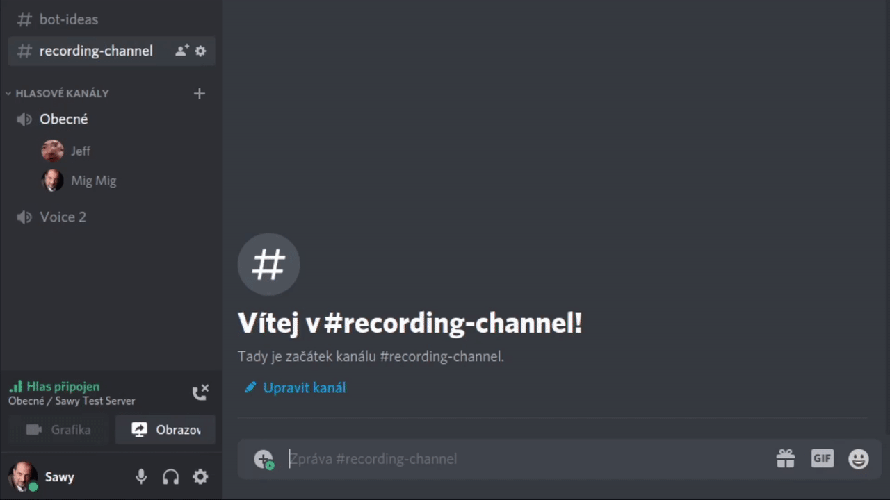
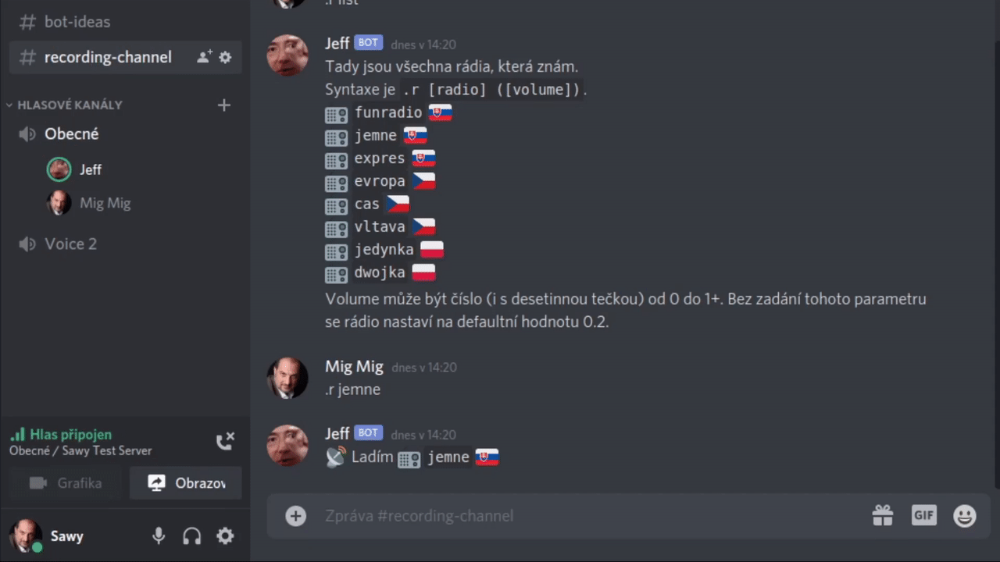
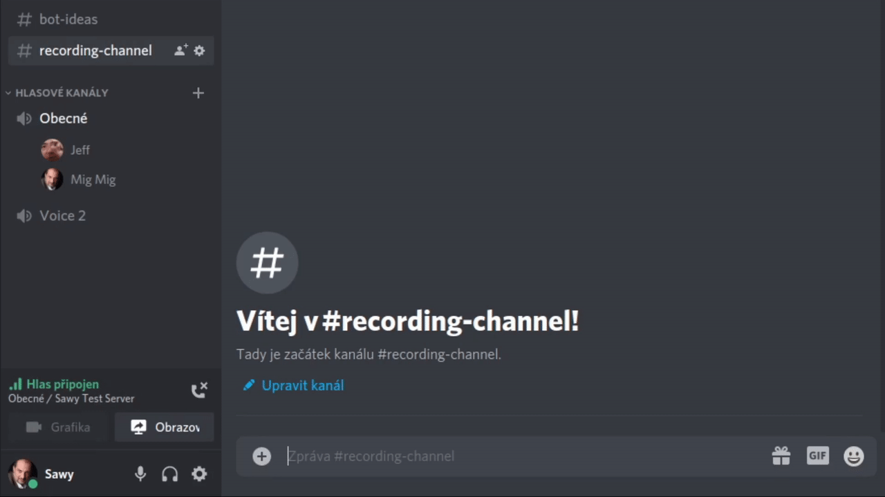

# Jeff GIF help (CZ)

## Zvukové efekty
Příkazy:
```
.s list <-- vypíše všechny dostupné zvukové efekty
```
```
.s [efekt] <-- přehraje vybraný efekt
```


## Rádio
Příkazy:
```
.r list <-- vypíše všechna dostupná rádia
```
```
.r [radio] ([volume]) <-- přehraje vybrané rádio
```
>Poznámka: Pokud uživatel nezadá hodnotu volume v intervalu <0,1> (s desetinnou TEČKOU), pak se rádio spustí s defaultní hodnotou 0.2 (20 %).



## STOP
Příkazy:
```
.stop <-- přestane přehrávat aktuální audio
```


## Google TTS (hlas)
Příkazy:
```
.t [zprava] <-- bot vysloví zadanou zprávu hlasem Google Translatoru
```


## Přesouvání uživatelů
Příkazy:
```
.moveall <-- umožní přesunout všechny účastníky aktuálního kanálu hlasového do jiného
```

